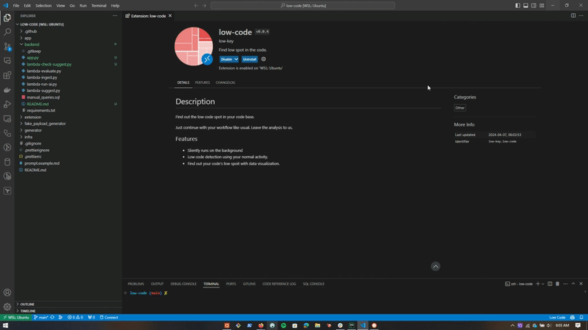
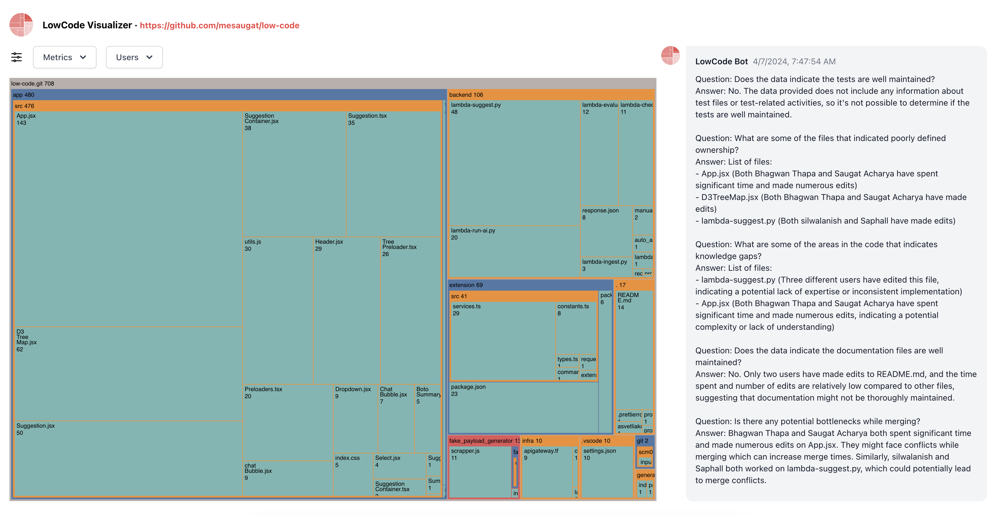

# Low-Code

This project is a low-code VSCode extension and visualizer built with `React`, `D3`, `Python`, `ClickHouse`, and `Bedrock`.

> It visualizes data in a treemap format, allowing users to understand the structure and distribution of code updates at a glance.

## Infrastructure Components

- **Terraform**:

  [Terraform](https://www.terraform.io/) is used to provision the AWS Infrastructures.

- **VS Code Extension**:

  The extension captures change data from the user's codebase changes and sends it to the backend for processing.

- **Backend**:

  The backend is written in Python and utilizes [AWS Lambda](https://aws.amazon.com/lambda/), [API Gateway](https://aws.amazon.com/api-gateway/), and [ClickHouse](https://aws.amazon.com/solutions/implementations/clickhouse-cluster/) installed in an EC2 instance using Terraform. The ingestion process involves parsing the change data and storing it in [ClickHouse](https://aws.amazon.com/solutions/implementations/clickhouse-cluster/). The backend also provides an API to query the data through [API Gateway](https://aws.amazon.com/api-gateway/). The backend also uses [AWS Bedrock](https://aws.amazon.com/bedrock/) to analyze the event data and generate insights using Mistral Large.

- **Frontend**:

  The frontend is built with [React](https://react.dev/) and [D3](https://d3js.org/) and deployed in [Cloudfront](https://aws.amazon.com/cloudfront/). It fetches the data from the backend and visualizes it in a treemap format. It shows how much time has been spent in the codebase by different users. The treemap is interactive and you can filter by time spent, number of edits, and user.

## Demo

### Screenshot

