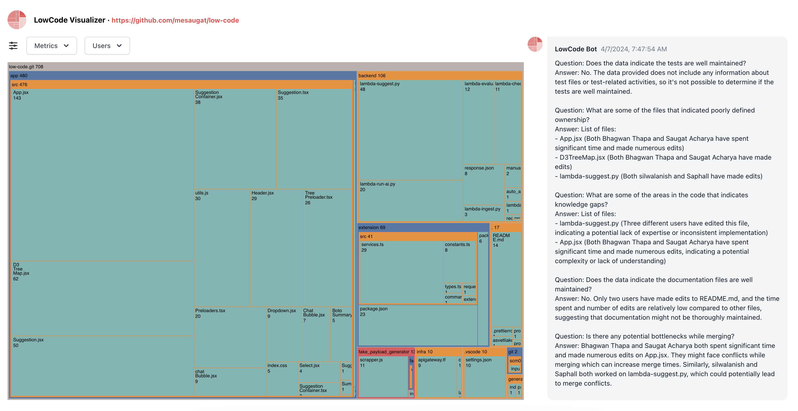

# Low-Code

**Gather team and code insights as it arrives!**

# Description

Find out the low code spot in your code base.

Just continue with your workflow like usual. Leave the analysis to us.

## Features

- Sliently runs on the background
- Low code detection using your normal activity.
- Find out your code's low spoit with data visualization.

 

